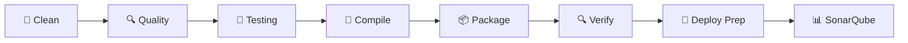

# 🚀 GRADLE BUILD PIPELINE CON MÚLTIPLES STAGES

## 🎯 **CONFIGURACIÓN IMPLEMENTADA**

He configurado un **pipeline de build completo** con múltiples stages organizados y un task principal `runMain` que ejecuta todo el proceso de construcción.

---

## 🏗️ **ARQUITECTURA DEL PIPELINE**

### 📋 **8 Stages Configurados:**



### 🎯 **Stage Details:**

1. **🧹 Clean Stage** - Limpieza de artifacts
2. **🔍 Code Quality** - Análisis estático
3. **🧪 Testing** - Tests + Cobertura
4. **🔧 Compilation** - Compilación completa
5. **📦 Packaging** - Creación de JARs
6. **🔍 Quality Verification** - Verificación umbrales
7. **🚀 Deployment Prep** - Preparación deploy
8. **📊 SonarQube** - Análisis opcional

---

## 🚀 **COMANDOS PRINCIPALES**

### 🎯 **Pipeline Completo:**
```bash
# Ejecutar pipeline completo con todos los stages
./gradlew runMain

# Pipeline completo con SonarQube
./gradlew runMain -PrunSonar=true
```

### ⚡ **Pipelines Específicos:**
```bash
# Build rápido (sin SonarQube)
./gradlew quickBuild

# Solo testing y cobertura
./gradlew testOnly

# Build sin tests (desarrollo rápido)
./gradlew buildNoTest

# Solo verificación de calidad
./gradlew qualityCheck

# Solo reporte de cobertura
./gradlew coverageReport
```

### 🔧 **Stages Individuales:**
```bash
# Ejecutar stage específico
./gradlew cleanStage
./gradlew codeQualityStage
./gradlew testingStage
./gradlew compilationStage
./gradlew packagingStage
./gradlew qualityVerificationStage
./gradlew deploymentPrepStage
./gradlew sonarAnalysisStage
```

---

## 📊 **OUTPUT DEL PIPELINE**

### 🚀 **Inicio del Pipeline:**
```
🚀 =============================================
🏗️           ARKA VALENZUELA BUILD PIPELINE
🚀 =============================================

📋 Pipeline Stages:
   1. 🧹 Cleaning
   2. 🔍 Code Quality Analysis  
   3. 🧪 Testing & Coverage
   4. 🔧 Compilation
   5. 📦 Packaging
   6. 🔍 Quality Verification
   7. 🚀 Deployment Preparation
   8. 📊 SonarQube Analysis (optional)

🎯 Starting complete build pipeline...
```

### ✅ **Finalización Exitosa:**
```
🎉 =============================================
🏆           BUILD PIPELINE COMPLETED
🎉 =============================================

✅ All stages completed successfully!

📊 Build Summary:
   🧹 Cleaned: All artifacts removed
   🔍 Quality: Code analysis passed
   🧪 Tests: All tests passed with coverage
   🔧 Compiled: All modules compiled
   📦 Packaged: JAR files created
   🔍 Verified: Quality gates met
   🚀 Ready: Deployment artifacts prepared

📂 Generated Artifacts:
   📦 JAR files: build/libs/
   📊 Test reports: build/reports/tests/
   📈 Coverage: build/reports/jacoco/
   📋 Build logs: Available in console

🚀 Next Steps:
   🐳 Docker: ./gradlew dockerBuild
   ☁️  Deploy: ./gradlew deploy
   📊 SonarQube: ./gradlew runMain -PrunSonar=true
```

---

## 🏗️ **DETALLES DE CADA STAGE**

### 🧹 **Stage 1: Cleaning**
```gradle
task cleanStage {
    // Limpia todos los build artifacts
    // Remueve cache files
    // Prepara ambiente limpio
}
```
**Incluye:**
- Clean del proyecto principal
- Clean de todos los submódulos
- Limpieza de cache

### 🔍 **Stage 2: Code Quality Analysis**
```gradle
task codeQualityStage {
    // Análisis estático de código
    // Verificación de estilo
    // Detección de code smells
}
```
**Preparado para:**
- Checkstyle
- PMD
- SpotBugs
- SonarQube local

### 🧪 **Stage 3: Testing**
```gradle
task testingStage {
    // Tests unitarios
    // Tests de integración
    // Generación de cobertura
}
```
**Ejecuta:**
- Tests del proyecto principal
- Tests de todos los submódulos
- JaCoCo coverage reports
- Reporte agregado

### 🔧 **Stage 4: Compilation**
```gradle
task compilationStage {
    // Compilación de código fuente
    // Compilación de tests
    // Verificación de sintaxis
}
```
**Compila:**
- Main classes
- Test classes
- Todos los submódulos

### 📦 **Stage 5: Packaging**
```gradle
task packagingStage {
    // Creación de JAR files
    // Empaquetado de recursos
    // Preparación artifacts
}
```
**Genera:**
- JAR ejecutables
- WAR files
- Recursos empaquetados

### 🔍 **Stage 6: Quality Verification**
```gradle
task qualityVerificationStage {
    // Verificación umbrales cobertura
    // Quality gates
    // Validación métricas
}
```
**Verifica:**
- Cobertura mínima (60%)
- Quality gates
- Métricas de calidad

### 🚀 **Stage 7: Deployment Preparation**
```gradle
task deploymentPrepStage {
    // Validación Docker files
    // Preparación artifacts cloud
    // Verificación configuraciones
}
```
**Prepara:**
- Docker configurations
- Cloud deployment artifacts
- Environment configs

### 📊 **Stage 8: SonarQube Analysis**
```gradle
task sonarAnalysisStage {
    // Análisis SonarQube
    // Envío métricas
    // Technical debt analysis
}
```
**Opcional:**
- Uso: `-PrunSonar=true`
- Métricas a SonarQube
- Quality gates remotos

---

## 🛠️ **TASKS UTILITARIOS**

### ⚡ **Quick Build:**
```bash
./gradlew quickBuild
```
- Sin SonarQube
- Para desarrollo rápido
- Todas las verificaciones esenciales

### 🧪 **Test Only:**
```bash
./gradlew testOnly
```
- Solo tests y cobertura
- Verificación rápida
- Sin compilación completa

### 📦 **Build No Test:**
```bash
./gradlew buildNoTest
```
- ⚠️ Solo para desarrollo
- Sin ejecutar tests
- Build rápido

### 🔍 **Quality Check:**
```bash
./gradlew qualityCheck
```
- Solo verificaciones calidad
- Sin build completo
- Métricas y umbrales

### 📊 **Coverage Report:**
```bash
./gradlew coverageReport
```
- Solo reportes cobertura
- JaCoCo aggregated
- HTML + XML reports

---

## 🎯 **CONFIGURACIÓN AVANZADA**

### 🔧 **Variables de Entorno:**
```bash
# Habilitar SonarQube
export SONAR_ENABLED=true

# Cambiar umbral cobertura
export COVERAGE_THRESHOLD=70

# Skip tests específicos
export SKIP_INTEGRATION_TESTS=true
```

### 📊 **Propiedades Gradle:**
```bash
# Ejecutar con SonarQube
./gradlew runMain -PrunSonar=true

# Cambiar nivel logging
./gradlew runMain --info

# Parallel execution
./gradlew runMain --parallel
```

### 🐳 **Integración Docker:**
```bash
# Build + Docker
./gradlew runMain dockerBuild

# Complete pipeline + Deploy
./gradlew runMain deploy
```

---

## 📂 **ARTIFACTS GENERADOS**

### 📦 **Build Artifacts:**
```
build/
├── libs/
│   ├── arkavalenzuela-0.0.1-SNAPSHOT.jar
│   └── arkavalenzuela-0.0.1-SNAPSHOT.war
├── reports/
│   ├── tests/test/html/index.html
│   ├── jacoco/aggregate/html/index.html
│   └── jacoco/aggregate/jacocoTestReport.xml
└── distributions/
    └── arkavalenzuela-0.0.1-SNAPSHOT.tar
```

### 🏢 **Submódulos:**
```
api-gateway/build/libs/api-gateway.jar
eureka-server/build/libs/eureka-server.jar
config-server/build/libs/config-server.jar
arca-cotizador/build/libs/arca-cotizador.jar
arca-gestor-solicitudes/build/libs/arca-gestor-solicitudes.jar
hello-world-service/build/libs/hello-world-service.jar
```

---

## 🔄 **INTEGRACIÓN CI/CD**

### 🚀 **GitHub Actions Example:**
```yaml
name: Build Pipeline
on: [push, pull_request]

jobs:
  build:
    runs-on: ubuntu-latest
    steps:
      - uses: actions/checkout@v3
      - uses: actions/setup-java@v3
        with:
          java-version: '21'
      
      - name: Run Complete Pipeline
        run: ./gradlew runMain -PrunSonar=true
        env:
          SONAR_TOKEN: ${{ secrets.SONAR_TOKEN }}
      
      - name: Upload Coverage Reports
        uses: actions/upload-artifact@v3
        with:
          name: coverage-reports
          path: build/reports/jacoco/
```

### 🐳 **Docker Integration:**
```bash
# Pipeline + Docker build
./gradlew runMain && docker-compose build

# Complete deployment
./gradlew runMain && docker-compose up -d
```

---

## 🎯 **BENEFICIOS IMPLEMENTADOS**

### 👨‍💻 **Para Desarrolladores:**
- ✅ **Pipeline visual** con progress claro
- ✅ **Tasks granulares** para testing específico
- ✅ **Feedback inmediato** en cada stage
- ✅ **Builds rápidos** para desarrollo

### 🏢 **Para CI/CD:**
- ✅ **Stages organizados** y secuenciales
- ✅ **Artifacts controlados** y consistentes
- ✅ **Quality gates** automáticos
- ✅ **Reportes completos** para análisis

### 🔍 **Para Calidad:**
- ✅ **Cobertura verificada** (60% mínimo)
- ✅ **Análisis estático** integrado
- ✅ **SonarQube opcional** pero configurado
- ✅ **Métricas centralizadas**

---

*🚀 **Pipeline de build completo configurado con 8 stages organizados y task runMain principal***