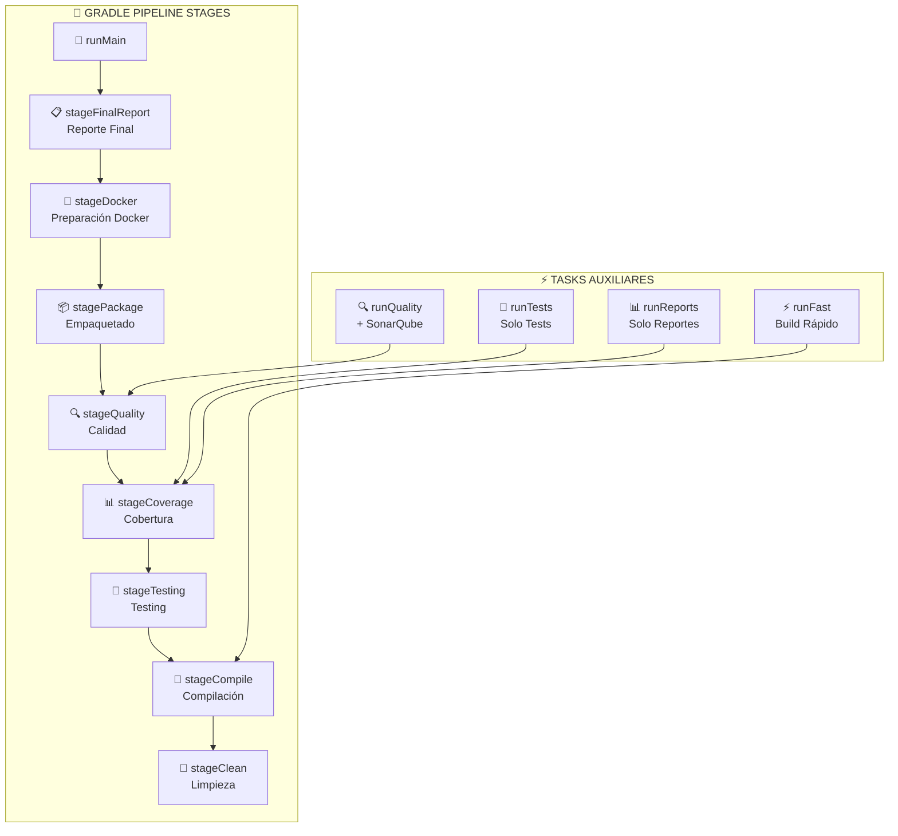

# 🚀 GRADLE BUILD PIPELINE CON RUNMAIN

## 🎯 **OVERVIEW**

He configurado un **pipeline completo** de build con el task `runMain` que ejecuta **8 stages secuenciales** para un proceso de construcción profesional.

---

## 🔧 **COMANDOS PRINCIPALES**

### 🚀 **Pipeline Completo:**
```bash
# Ejecutar pipeline completo (8 stages)
./gradlew runMain

# Ver todos los tasks disponibles
./gradlew tasks --group=application
./gradlew tasks --group=pipeline
```

### ⚡ **Pipelines Especializados:**
```bash
# Solo testing y cobertura
./gradlew runTests

# Análisis completo con SonarQube
./gradlew runQuality

# Build rápido sin tests
./gradlew runFast

# Solo generar reportes
./gradlew runReports
```

---

## 📋 **8 STAGES DEL PIPELINE PRINCIPAL**

### 🧹 **Stage 1: Limpieza**
```bash
./gradlew stageClean
```
- ✅ Limpia artefactos anteriores
- ✅ Prepara workspace limpio
- ✅ Elimina builds previos

### 🔧 **Stage 2: Compilación**
```bash
./gradlew stageCompile
```
- ✅ Compila código fuente Java 21
- ✅ Procesa recursos
- ✅ Valida sintaxis

### 🧪 **Stage 3: Testing**
```bash
./gradlew stageTesting
```
- ✅ Tests unitarios (JUnit 5)
- ✅ Tests de integración
- ✅ Tests de seguridad
- ✅ Tests reactivos

### 📊 **Stage 4: Cobertura**
```bash
./gradlew stageCoverage
```
- ✅ Análisis JaCoCo
- ✅ Reportes HTML/XML
- ✅ Reporte agregado multi-módulo

### 🔍 **Stage 5: Calidad**
```bash
./gradlew stageQuality
```
- ✅ Verificación umbrales (60% mínimo)
- ✅ Validación métricas
- ✅ Gates de calidad

### 📦 **Stage 6: Empaquetado**
```bash
./gradlew stagePackage
```
- ✅ Genera JAR ejecutable
- ✅ Crea WAR para despliegue
- ✅ Empaqueta dependencias

### 🐳 **Stage 7: Docker**
```bash
./gradlew stageDocker
```
- ✅ Prepara para containerización
- ✅ Valida Dockerfiles
- ✅ Lista para `docker-compose build`

### 📋 **Stage 8: Reporte Final**
```bash
./gradlew stageFinalReport
```
- ✅ Resumen completo
- ✅ Ubicaciones de artefactos
- ✅ Próximos pasos sugeridos

---

## 🎯 **SALIDA DEL PIPELINE**

### 📊 **Durante la Ejecución:**
```
🚀 ====================================================
    INICIANDO PIPELINE PRINCIPAL ARKA VALENZUELA
🚀 ====================================================

🧹 ==================== STAGE 1 ====================
    LIMPIEZA DE ARTEFACTOS
🧹 ===================================================
✅ Stage 1 Completado: Limpieza exitosa

🔧 ==================== STAGE 2 ====================
    COMPILACIÓN DEL CÓDIGO FUENTE
🔧 ===================================================
✅ Stage 2 Completado: Compilación exitosa

... (continúa con todos los stages) ...
```

### 🎉 **Reporte Final:**
```
🎉 ====================================================
    PIPELINE COMPLETADO EXITOSAMENTE
🎉 ====================================================

📊 RESUMEN DE ARTEFACTOS GENERADOS:
   • JAR Principal: build/libs/arkavalenzuela-2-0.0.1-SNAPSHOT.jar
   • Reportes de Tests: build/reports/tests/test/index.html
   • Cobertura HTML: build/reports/jacoco/aggregate/html/index.html
   • Cobertura XML: build/reports/jacoco/aggregate/jacocoTestReport.xml

🚀 PRÓXIMOS PASOS:
   • Revisar reportes de cobertura
   • Ejecutar SonarQube: ./gradlew sonarqube
   • Desplegar con Docker: docker-compose up

✅ BUILD EXITOSO - TODOS LOS STAGES COMPLETADOS
```

---

## 📂 **ARTEFACTOS GENERADOS**

### 📦 **Ejecutables:**
```
build/libs/
├── arkavalenzuela-2-0.0.1-SNAPSHOT.jar     # JAR principal
├── arkavalenzuela-2-0.0.1-SNAPSHOT.war     # WAR para deploy
└── arkavalenzuela-2-0.0.1-SNAPSHOT-plain.jar  # JAR sin dependencias
```

### 📊 **Reportes:**
```
build/reports/
├── tests/test/index.html                    # Resultados tests
├── jacoco/
│   ├── test/html/index.html                # Cobertura módulo
│   ├── aggregate/html/index.html           # Cobertura agregada
│   └── aggregate/jacocoTestReport.xml      # XML para SonarQube
└── build/
    └── distributions/                      # Distribuciones
```

---

## 🔄 **FLUJO DE DEPENDENCIAS**



---

## 🎯 **CASOS DE USO**

### 👨‍💻 **Para Desarrolladores:**

```bash
# Desarrollo diario - build rápido
./gradlew runFast

# Antes de commit - con tests
./gradlew runTests

# Revisión de cobertura
./gradlew runReports
```

### 🔄 **Para CI/CD:**

```bash
# Pipeline completo en CI
./gradlew runMain

# Con análisis de calidad
./gradlew runQuality
```

### 🚀 **Para Releases:**

```bash
# Build completo + preparación Docker
./gradlew runMain

# Después construir imágenes
docker-compose build
```

---

## ⚙️ **CONFIGURACIÓN AVANZADA**

### 🎯 **Personalizar Umbrales:**
```gradle
// En build.gradle
jacocoTestCoverageVerification {
    violationRules {
        rule {
            limit {
                minimum = 0.70  // Cambiar a 70%
            }
        }
    }
}
```

### 🚫 **Agregar Exclusiones:**
```gradle
// Excluir más patrones
exclude: [
    '**/config/**',
    '**/dto/**',
    '**/*Application*',
    '**/Vulnerable*',
    '**/CodeSmells*',
    '**/custom-pattern/**'  // Tu patrón personalizado
]
```

### 🔍 **Integrar con IDEs:**

**IntelliJ IDEA:**
- Gradle tab → application → runMain
- O usar terminal integrado: `./gradlew runMain`

**VS Code:**
- Command Palette → "Tasks: Run Task" → "gradle: runMain"
- O terminal integrado

---

## 📊 **MÉTRICAS Y MONITOREO**

### ⏱️ **Tiempos Esperados:**
- **Stage 1-2**: ~30 segundos
- **Stage 3**: ~2-5 minutos (según tests)
- **Stage 4-5**: ~1 minuto
- **Stage 6-8**: ~30 segundos
- **Total**: ~5-8 minutos

### 📈 **Métricas de Calidad:**
- **Cobertura**: ≥60% (configurable)
- **Tests**: Todos deben pasar
- **Compilación**: Sin warnings críticos
- **Artefactos**: JAR/WAR válidos

---

## 🚨 **TROUBLESHOOTING**

### ❌ **Si falla Stage 3 (Tests):**
```bash
# Ver detalles del error
./gradlew test --info

# Ejecutar test específico
./gradlew test --tests "NombreDelTest"
```

### ❌ **Si falla Stage 5 (Cobertura):**
```bash
# Ver reporte de cobertura
open build/reports/jacoco/aggregate/html/index.html

# Bajar umbral temporalmente
# (editar build.gradle minimum = 0.40)
```

### ❌ **Si falla Stage 6 (Build):**
```bash
# Limpiar y reintentar
./gradlew clean build --refresh-dependencies
```

---

## 🎉 **BENEFICIOS IMPLEMENTADOS**

### ✅ **Para el Proyecto:**
- **Pipeline estructurado** con stages claros
- **Feedback visual** en cada etapa
- **Artefactos organizados** y localizables
- **Flexibilidad** con tasks auxiliares

### ✅ **Para Desarrolladores:**
- **Comandos simples** (`runMain`, `runFast`, etc.)
- **Feedback inmediato** de progreso
- **Informes detallados** de ubicación de archivos
- **Debugging fácil** por stages

### ✅ **Para CI/CD:**
- **Pipeline reproducible**
- **Stages independientes** verificables
- **Integración** con SonarQube lista
- **Artefactos** listos para despliegue

---

*🚀 **Pipeline de build profesional configurado con 8 stages y múltiples comandos auxiliares***
