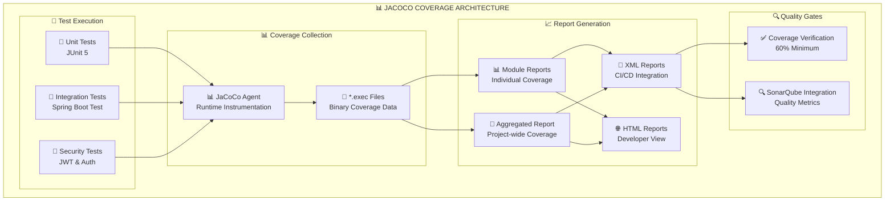

# 📊 CONFIGURACIÓN JACOCO PARA TESTING CONTINUO

## 🎯 **CONFIGURACIÓN IMPLEMENTADA**

He configurado **JaCoCo** (Java Code Coverage) completo para testing continuo en el proyecto Arka Valenzuela con:

### ✅ **Funcionalidades Implementadas:**

1. **📊 Análisis de Cobertura por Módulo**
2. **🔄 Reporte Agregado Multi-Módulo**
3. **🔗 Integración con SonarQube**
4. **🚫 Exclusiones Inteligentes**
5. **📈 Verificación de Umbrales**

---

## 🛠️ **COMANDOS PRINCIPALES**

### 📊 **Generar Reportes de Cobertura**

```bash
# Ejecutar tests y generar reporte de cobertura
./gradlew test jacocoTestReport

# Reporte agregado de todos los módulos
./gradlew jacocoAggregatedReport

# Verificar umbral de cobertura (60% mínimo)
./gradlew jacocoTestCoverageVerification

# Ejecutar todo el pipeline de testing
./gradlew clean test jacocoTestReport jacocoAggregatedReport
```

### 🔍 **Integración con SonarQube**

```bash
# Análisis completo con cobertura
./gradlew clean test jacocoAggregatedReport sonarqube

# Solo SonarQube (si ya tienes reportes)
./gradlew sonarqube -Dsonar.host.url=http://localhost:9000
```

---

## 📂 **UBICACIÓN DE REPORTES**

### 📊 **Reportes por Módulo:**
```
build/reports/jacoco/test/html/index.html
build/reports/jacoco/test/jacocoTestReport.xml
```

### 🔄 **Reporte Agregado:**
```
build/reports/jacoco/aggregate/html/index.html
build/reports/jacoco/aggregate/jacocoTestReport.xml
```

### 📁 **Estructura Completa:**
```
build/
├── reports/
│   ├── jacoco/
│   │   ├── test/                    # Reportes individuales
│   │   │   ├── html/index.html      # Reporte visual HTML
│   │   │   └── jacocoTestReport.xml # Reporte XML para CI/CD
│   │   └── aggregate/               # Reporte combinado
│   │       ├── html/index.html      # Vista consolidada
│   │       └── jacocoTestReport.xml # XML para SonarQube
│   └── tests/
│       └── test/                    # Resultados JUnit
└── jacoco/
    └── test.exec                    # Datos binarios de ejecución
```

---

## ⚙️ **CONFIGURACIÓN DETALLADA**

### 🎯 **Umbrales de Cobertura:**
- **Mínimo General**: 60%
- **Líneas**: Medición principal
- **Ramas**: Incluido en análisis
- **Métodos**: Verificación automática

### 🚫 **Exclusiones Configuradas:**
```gradle
// Archivos excluidos del análisis
'**/config/**'          // Configuraciones Spring
'**/dto/**'             // Data Transfer Objects
'**/*Application*'      // Clases principales Spring Boot
'**/Vulnerable*'        // Código de testing inseguro
'**/CodeSmells*'        // Anti-patrones de prueba
'**/test/**'           // Código de testing
```

### 🔧 **Versión JaCoCo:**
- **Versión**: 0.8.11 (última estable)
- **Compatibilidad**: Java 21
- **Formatos**: HTML, XML, CSV (opcional)

---

## 🏗️ **ARQUITECTURA DE COBERTURA**



---

## 🎯 **MÉTRICAS DISPONIBLES**

### 📊 **Cobertura por Tipo:**
- **📏 Line Coverage**: Líneas ejecutadas vs total
- **🌿 Branch Coverage**: Ramas de decisión cubiertas
- **🔧 Method Coverage**: Métodos invocados
- **📦 Class Coverage**: Clases instanciadas

### 📈 **Reportes Visuales:**
- **🎨 Código coloreado**: Verde (cubierto), Rojo (no cubierto)
- **📊 Gráficos de barras**: Porcentajes por paquete
- **📋 Tablas detalladas**: Métricas por clase/método
- **🔍 Drill-down**: Navegación hasta nivel de línea

---

## 🔄 **INTEGRACIÓN CI/CD**

### 🚀 **Pipeline Automatizado:**

```yaml
# Ejemplo para GitHub Actions
steps:
  - name: Run Tests with Coverage
    run: ./gradlew clean test jacocoTestReport
    
  - name: Generate Aggregated Report
    run: ./gradlew jacocoAggregatedReport
    
  - name: Verify Coverage Threshold
    run: ./gradlew jacocoTestCoverageVerification
    
  - name: SonarQube Analysis
    run: ./gradlew sonarqube
    env:
      SONAR_TOKEN: ${{ secrets.SONAR_TOKEN }}
```

### 📊 **Artifacts Generados:**
- ✅ Reportes HTML para desarrolladores
- ✅ XML para herramientas de CI/CD
- ✅ Métricas para SonarQube
- ✅ Datos para dashboards de calidad

---

## 🧪 **TESTING CONTINUO**

### 🔄 **Flujo Automático:**

1. **🧪 Ejecución de Tests**: JUnit 5 + Spring Boot Test
2. **📊 Instrumentación**: JaCoCo agent en runtime
3. **📁 Recolección**: Datos binarios (.exec files)
4. **📈 Generación**: Reportes HTML + XML
5. **✅ Verificación**: Umbrales de calidad
6. **🔍 Análisis**: Envío a SonarQube

### ⚡ **Optimizaciones:**
- **🚀 Paralelización**: Tests en paralelo
- **💾 Cache**: Gradle build cache
- **🎯 Exclusiones**: Solo código relevante
- **📊 Incremental**: Solo cambios

---

## 🎯 **BENEFICIOS IMPLEMENTADOS**

### 👨‍💻 **Para Desarrolladores:**
- ✅ **Feedback inmediato** sobre cobertura
- ✅ **Identificación de código no testado**
- ✅ **Reportes visuales** fáciles de entender
- ✅ **Integración con IDE** (IntelliJ, VSCode)

### 🏢 **Para el Proyecto:**
- ✅ **Calidad de código** medible
- ✅ **Prevención de regresiones**
- ✅ **Métricas de progreso** del testing
- ✅ **Integración con herramientas** de calidad

### 🔄 **Para CI/CD:**
- ✅ **Gates automáticos** de calidad
- ✅ **Reportes** en cada build
- ✅ **Histórico de cobertura**
- ✅ **Integración** con SonarQube

---

## 📋 **PRÓXIMOS PASOS**

### 1. **🧪 Ejecutar Primera Medición:**
```bash
./gradlew clean test jacocoAggregatedReport
```

### 2. **🌐 Visualizar Reportes:**
- Abrir: `build/reports/jacoco/aggregate/html/index.html`
- Revisar cobertura por módulo y clase

### 3. **🎯 Mejorar Cobertura:**
- Identificar clases con baja cobertura
- Agregar tests unitarios específicos
- Excluir código no testeable (configuraciones)

### 4. **🔍 Integrar con SonarQube:**
```bash
./gradlew sonarqube
```

---

*🎯 **JaCoCo configurado exitosamente para testing continuo con cobertura completa del proyecto***